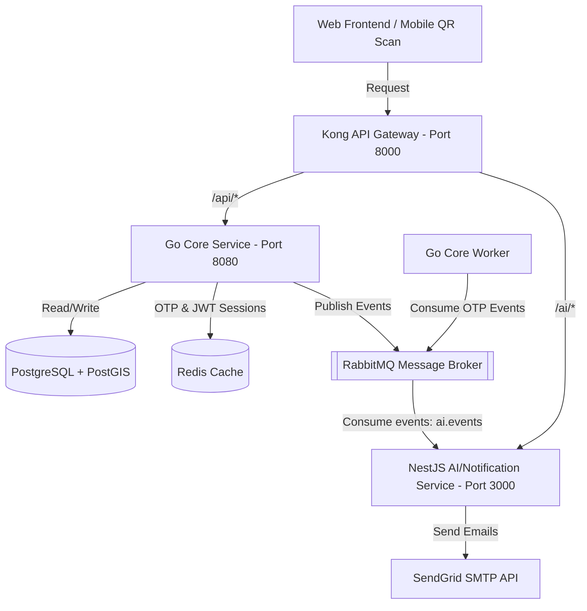

# Đánh Giá Mức Độ Sẵn Sàng Triển Khai (Deployment Readiness Review)
**Dự án:** ProductTrace-AI (Hệ thống truy xuất nguồn gốc sản phẩm tích hợp AI)  
**Vai trò:** Senior Software Architect / Tech Lead  
**Ngày đánh giá:** 2026-07-09  

---

## 1. Tổng quan dự án

### Kiến trúc hiện tại
Hệ thống được thiết kế theo mô hình **Microservices kết hợp Event-Driven Architecture (EDA)** nhằm đảm bảo tính phân tách mối quan tâm (Separation of Concerns), khả năng mở rộng (scalability) và hiệu năng xử lý.

### Các service đang có
1. **`go-core-service`**:
   - Đóng vai trò là service trung tâm xử lý logic nghiệp vụ chính (User, Products, Batches, Locations, Ownerships, Warranties).
   - Viết bằng **Go (Gin GORM)**.
   - Chạy 2 Docker container độc lập từ cùng một codebase: 
     - `Dockerfile.api`: chạy HTTP Restful API Server.
     - `Dockerfile.worker`: chạy nền background consumer (xử lý OTP nội bộ).
2. **`nest-ai-service`**:
   - Đóng vai trò microservice xử lý tác vụ liên quan đến thông báo (gửi Email qua SendGrid) và các tính năng AI mở rộng trong tương lai.
   - Viết bằng **NestJS**.
   - Consumes các event bất đồng bộ từ RabbitMQ queue `ai.events`.
3. **`web-frontend`**:
   - Ứng dụng phía người dùng viết bằng **React 19 + TypeScript + TailwindCSS + Vite**.
   - Phân tách làm 2 view chính: `AdminApp` (quản trị viên, nhà sản xuất) và `CustomerApp` (khách hàng quét QR, đăng ký sở hữu, bảo hành).

### Công nghệ sử dụng
- **Backend API**: Go 1.22+, Gin Web Framework, GORM v2.
- **Microservices & Messaging**: NestJS, RabbitMQ (Topic Exchange), SendGrid API.
- **Database & Cache**: PostgreSQL 16 (PostGIS), Redis 8-alpine.
- **Infrastructure & Gateway**: Kong Gateway 3.13 (DB-less mode), Docker Compose, `golang-migrate/migrate`.
- **Frontend**: React 19, TypeScript, TailwindCSS v4, Lucide Icons, Framer Motion.

### Flow giao tiếp giữa FE - BE - Database - Message Queue - Cache
1. **API Routing**: Client gửi request qua Kong API Gateway (cổng `8000`). Kong route `/api` về Go Core và `/ai` về NestJS Service.
2. **Synchronous Flow**: Với các API nghiệp vụ thông thường (truy vấn sản phẩm, lô hàng), Go Core truy vấn trực tiếp PostgreSQL hoặc Redis cache để phản hồi nhanh nhất.
3. **Asynchronous Flow (Decoupled)**: 
   - Khi người dùng đăng ký (`/auth/register`) hoặc quên mật khẩu (`/auth/forgot-password`), Go Core lưu thông tin vào DB/Redis rồi phát ra event (ví dụ: `user.registered`).
   - `worker-service` (Go) consume event đó, tự động sinh mã OTP ngẫu nhiên, lưu OTP vào Redis (TTL 5 phút) rồi gửi tiếp event `otp.registered` tới RabbitMQ.
   - NestJS Notification Service lắng nghe queue `ai.events` trên RabbitMQ, bắt được event `otp.registered` và gọi API của SendGrid gửi email cho người dùng bất đồng bộ.

---

## 2. Đánh giá Backend

Backend được tổ chức rất bài bản theo mô hình **Module-based Layered Architecture** (Handler -> Service -> Repository -> Entity). Tuy nhiên vẫn tồn tại một số điểm hạn chế cần khắc phục trước khi đem ra production.

### Bảng đánh giá chi tiết

| Tiêu chí | Trạng thái | Đánh giá thực tế & Đề xuất sửa đổi |
| :--- | :---: | :--- |
| **Cấu trúc source code & Architecture** | ✅ Good | Cấu trúc thư mục theo chuẩn Go layout (`/cmd`, `/internal`, `/pkg`). Các module (`user`, `authen`, `product`, `batch`) được đóng gói đầy đủ các tầng. Có cơ chế transaction propagation tốt qua context. |
| **Controller / Service / Repository** | ✅ Good | Sự phân tách trách nhiệm rất rõ ràng. Tầng Handler chỉ bind dữ liệu DTO, Service xử lý logic, Repository chỉ giao tiếp DB qua GORM. |
| **Error Handling** | ✅ Good | Hệ thống sử dụng package `pkg/apperror` định nghĩa sẵn các mã lỗi chuẩn (`Validation`, `Unauthorized`, `NotFound`, `Internal`). Tầng middleware bắt lỗi tự động tập trung. |
| **Validation** | ✅ Good | Sử dụng Gin validator (`binding:"required,email,min=6"`) trong các struct request DTO. Rất chặt chẽ. |
| **Authentication & Authorization** | ⚠️ Improvement | - Sử dụng JWT cho Access Token và Redis lưu trữ Refresh Token (TTL 7 ngày) kèm blacklist token khi Logout. Khá tốt. - **Hạn chế:** Tầng Access Token được xác thực trực tiếp qua Signature mà không check blacklist hoặc trạng thái user trong DB trên mỗi request (để tối ưu performance). Nếu một user bị Banned hoặc Admin thay đổi quyền hạn, Access Token cũ vẫn có hiệu lực cho đến khi hết hạn (ví dụ: 15-30 phút). |
| **OTP Flow** | ✅ Good | Cơ chế OTP lưu trữ trong Redis có TTL 5 phút đảm bảo tính bảo mật. Luồng OTP bất đồng bộ qua RabbitMQ giúp tối ưu hóa thời gian phản hồi (API register trả về dưới 200ms). |
| **Security Issues** | ❌ Critical | **Thiếu CORS Middleware** trong Go Core Service và cấu hình Kong. Nếu Frontend deploy khác origin (khác port/domain) với backend, trình duyệt sẽ chặn toàn bộ request. |
| **Logging** | ⚠️ Improvement | Vẫn sử dụng `log.Printf` mặc định của Go. Chưa cấu hình Structured Logger (như Zap hay Logrus) để hỗ trợ xuất log dạng JSON cho các hệ thống giám sát log tập trung (ELK, Loki). |
| **Performance & Cache** | ✅ Good | Tích hợp Redis cache tốt cho phiên đăng nhập và mã OTP. GORM được cấu hình tốt, sử dụng transactional context hợp lý. |
| **Database Design** | ✅ Good | Thiết kế Database chuẩn hóa cực kỳ tốt. Sử dụng PostGIS cho dữ liệu địa lý (`geography`), hỗ trợ GIST indexes, GIN indexes cho JSONB, check constraints rõ ràng cho Role, Status và định dạng dữ liệu (regex cho Item Code, Verification Token). |
| **Migration** | ✅ Good | Sử dụng `golang-migrate` chạy tự động lúc khởi tạo Docker. Có cả file `.up.sql` và `.down.sql` rõ ràng. |
| **API Consistency** | ✅ Good | Toàn bộ response trả về qua struct wrapper chuẩn (`pkg/response`) gồm `success`, `message`, `data`. |
| **Environment Configuration** | ✅ Good | Đọc config từ file `.env` qua `godotenv` lúc local và tự động fallback về Env variables của hệ thống ở production. |

### Các lỗi Backend nghiêm trọng cần sửa:
1. **Thiếu cấu hình CORS:**
   - **Vấn đề:** Trình duyệt sẽ chặn request từ FE sang BE.
   - **File cần sửa:** `d:\producttrace-ai\apps\go-core-service\internal\router\router.go`.
   - **Cách sửa:** Thêm CORS middleware sử dụng thư viện `github.com/gin-contrib/cors` hoặc viết custom middleware cho phép các origin chỉ định.
2. **Dư thừa code rác tại NestJS Service:**
   - **Vấn đề:** Sau khi gộp toàn bộ các consumer vào class duy nhất `NotificationConsumer` lắng nghe queue `ai.events`, các file consumer cũ như `user-registered.consumer.ts`, `password-reset.consumer.ts`, `user-verified.consumer.ts`, `product-created.consumer.ts` vẫn nằm trong thư mục `messaging/consumers`.
   - **Cách sửa:** Tiến hành xóa bỏ các file này để làm sạch source code, tránh gây hiểu lầm cho người maintain sau này.

---

## 3. Đánh giá Frontend

Frontend hiện tại đang ở trạng thái **Mockup Demo**, chưa hề có kết nối thật với Backend. Cấu trúc giao diện rất đẹp mắt và hiện đại (vibrant colors, glassmorphism, Framer Motion) nhưng tính sẵng sàng deploy là **RẤT THẤP** do thiếu code tích hợp API.

### Bảng đánh giá chi tiết

| Tiêu chí | Trạng thái | Đánh giá thực tế & Đề xuất sửa đổi |
| :--- | :---: | :--- |
| **Folder structure** | ✅ Good | Cấu trúc phân chia module rõ ràng: `/admin` cho trang quản trị, `/customer` cho khách hàng quét QR, `/shared` cho các UI components chung. |
| **Component organization** | ✅ Good | Các component nhỏ được tách biệt (UI buttons, cards, layout). Thiết kế hiện đại, responsive tốt. |
| **State management** | ❌ Critical | **Chưa có State Management:** Toàn bộ dữ liệu dựa vào local state của component (`useState`). Gây ra rủi ro prop drilling và không đồng bộ được trạng thái đăng nhập giữa các trang. Nên sử dụng **Zustand** hoặc **Redux Toolkit** để quản lý Auth State và Cart/Scan State. |
| **API Integration** | ❌ Critical | **Chưa tích hợp API:** Hoàn toàn sử dụng dữ liệu tĩnh `MOCK_PRODUCTS` và mock functions. Chưa cài đặt Axios instance, chưa có API layers để gọi lên backend. |
| **Authentication Flow** | ❌ Critical | **Chức năng Login chỉ là giả lập:** Nút login chỉ đơn giản là set state `isLoggedOut = false` trong `Layout.tsx`. Không gửi HTTP POST `/api/auth/login`, không lưu JWT token vào LocalStorage/Cookie, không có Refresh Token logic. |
| **Route Protection** | ❌ Critical | **Thiếu Auth Guards:** Không có kiểm tra token khi truy cập vào các đường dẫn quản trị `/admin` hoặc `/dashboard`. Chỉ dựa vào việc check chuỗi URL path tĩnh để hiển thị giao diện Admin hay Customer. |
| **Error Handling & Loading** | ❌ Critical | Trạng thái loading và error được bật tắt thủ công qua nút "Demo Controls" ở góc trang thiết lập thay vì phản hồi thực tế từ HTTP response status. |
| **Form Validation** | ⚠️ Improvement | Chỉ sử dụng thuộc tính `required` mặc định của HTML. Nên tích hợp các thư viện chuyên nghiệp như `React Hook Form` kết hợp `Zod` để validate đầu vào phía client. |
| **Responsive UI** | ✅ Good | Sử dụng TailwindCSS kết hợp Bootstrap CSS, giao diện hiển thị tốt trên cả thiết bị di động (đặc biệt là CustomerApp được thiết kế theo dạng Mobile-first) và máy tính để bàn (Admin Dashboard). |
| **Environment Configuration** | ❌ Critical | **Không có file `.env`:** Chưa định nghĩa biến `VITE_API_URL` hay `VITE_SOCKET_URL`. Toàn bộ URL backend đang bị hardcode hoặc chưa khai báo. |

---

## 4. Đánh giá Infrastructure

Hệ thống cơ sở hạ tầng được thiết kế tốt, giúp việc đóng gói Docker trở nên vô cùng dễ dàng.

### Bảng đánh giá chi tiết

| Tiêu chí | Trạng thái | Đánh giá thực tế & Đề xuất sửa đổi |
| :--- | :---: | :--- |
| **Docker Compose** | ✅ Good | Docker Compose hoàn chỉnh, cấu hình đầy đủ network, volumes lưu trữ dữ liệu (Postgres, RabbitMQ) và cơ chế dependency checking (`condition: service_healthy`). |
| **Dockerfile** | ✅ Good | Có đầy đủ Dockerfile cho `go-core-service` (tách API và Worker) và `nest-ai-service`. Các Dockerfile tối ưu kích thước tốt. |
| **CI/CD** | ⚠️ Improvement | Hiện tại chưa có file cấu hình GitHub Actions hay GitLab CI/CD để tự động chạy test, build ảnh Docker và đẩy lên registry khi có commit mới. |
| **Reverse proxy / API Gateway** | ✅ Good | Kong Gateway chạy DB-less mode rất nhẹ và cấu hình tập trung tại `infra/kong/kong.yml`. Định tuyến chuẩn xác `/api` và `/ai`. |
| **Redis / RabbitMQ Deployment** | ✅ Good | Sử dụng Docker image chính thức có cấu hình đầy đủ healthcheck. RabbitMQ sử dụng image `management` hỗ trợ giao diện quản lý trực quan qua web. |
| **Database Deployment** | ✅ Good | PostgreSQL tích hợp sẵn extension `postgis/postgis:16-3.4` phục vụ tốt cho các chức năng liên quan đến tọa độ địa lý. |
| **Cloud Deployment Readiness** | ⚠️ Improvement | Rất dễ triển khai lên VPS (sử dụng Docker Compose). Tuy nhiên để deploy lên Kubernetes (AWS EKS, GKE) thì cần bổ sung các file manifest (Deployment, Service, Ingress). |

---

## 5. Security Checklist

Đánh giá các khía cạnh bảo mật từ góc nhìn Tech Lead:

- [x] **Password Hashing:** Đạt yêu cầu. Go Core sử dụng thuật toán Bcrypt an toàn để hash mật khẩu trước khi lưu DB.
- [x] **SQL Injection:** Đạt yêu cầu. Các câu lệnh SQL đều sử dụng GORM client (đã được parameterized tự động) hoặc dùng `db.Exec` với dấu `?` placeholder an toàn.
- [ ] **CORS Configuration:** ❌ **Thất bại.** Chưa cấu hình CORS ở Go Backend.
- [ ] **Rate Limiting:** ❌ **Thất bại.** Chưa có cơ chế giới hạn tần suất request (Rate Limiter). Điều này khiến kẻ tấn công có thể spam gửi hàng loạt request OTP (`/auth/register`, `/auth/resend-otp`), làm cạn kiệt tài khoản gửi email SendGrid hoặc gây nghẽn hệ thống.
- [ ] **JWT Security:** ⚠️ **Trung bình.** Token được ký bằng khóa bí mật bí mật (secret key) cấu hình ở Env. Tuy nhiên, Access Token chưa có cơ chế thu hồi tức thì (revocation) khi tài khoản bị khóa/banned.
- [x] **Sensitive Information Exposure:** Đạt yêu cầu. Module `authen` đã thiết kế bảo mật cho API `forgot-password` bằng cách luôn trả về mã HTTP `200 OK` (không tiết lộ email có tồn tại hay không).
- [ ] **XSS (Cross-Site Scripting):** ⚠️ **Cảnh báo.** Phía React Frontend chưa sử dụng các biện pháp filter đầu vào đặc biệt cho các input text nhập tự do trước khi hiển thị lên màn hình.
- [ ] **CSRF (Cross-Site Request Forgery):** ⚠️ **Cảnh báo.** Nếu lưu Access Token vào LocalStorage thì tránh được CSRF nhưng dễ bị XSS đánh cắp. Nếu lưu vào HttpOnly Cookie thì an toàn XSS nhưng cần cấu hình thêm CSRF token protection. Dự án chưa làm rõ điểm này.

---

## 6. Production Readiness Score

Dựa trên phân tích thực tế, tôi chấm điểm mức độ sẵn sàng triển khai của dự án như sau:

| Phân mục | Điểm số | Nhận xét chi tiết từ Tech Lead |
| :--- | :---: | :--- |
| **Backend** | **7 / 10** | Cấu trúc code sạch, chia tầng rõ ràng, logic OTP rất tối ưu. Điểm trừ lớn nhất là thiếu cấu hình CORS và cơ chế rate limiting cho các API nhạy cảm. |
| **Frontend** | **4 / 10** | UI đẹp và hoàn thiện về giao diện trực quan. Tuy nhiên hoàn toàn là **Mockup tĩnh**, chưa có bất kỳ dòng code nào gọi API thực tế của backend, thiếu Route Guard và State Management thực tế. |
| **Database** | **9 / 10** | Thiết kế xuất sắc, chỉn chu, ràng buộc dữ liệu chặt chẽ từ phía DB bằng check constraints, hỗ trợ chỉ mục địa lý (PostGIS). |
| **Infrastructure** | **8 / 10** | Setup Docker Compose và API Gateway Kong cực kỳ hoàn thiện, dễ dàng triển khai nhanh trên môi trường demo. |
| **Security** | **6 / 10** | Hash mật khẩu và chống SQL injection tốt. Cần bổ sung khân cấp CORS và Rate Limiter để chống tấn công từ chối dịch vụ (DoS) vào API gửi mail. |

### KẾT LUẬN: **CHƯA ĐỦ ĐIỀU KIỆN DEPLOY PRODUCTION/DEMO TỐT NGHIỆP**
*Dự án hiện tại chỉ có phần Backend và Infra là gần đạt trạng thái production. Phần Frontend vẫn chỉ là giao diện Demo tĩnh, chưa tích hợp được với Backend.*

#### Những lỗi BẮT BUỘC phải sửa trước khi deploy:
1. **Frontend:** Cài đặt Axios, viết logic login/register thực tế gọi lên backend qua cổng Kong Gateway (`http://localhost:8000/api/auth/login`).
2. **Frontend:** Lưu JWT Access Token và Refresh Token vào LocalStorage, đính kèm vào Header `Authorization: Bearer <token>` trên mỗi request.
3. **Frontend:** Xây dựng Route Guard ngăn chặn khách truy cập vào trang Admin `/dashboard`, `/users` khi chưa có token.
4. **Backend:** Bổ sung CORS middleware trong Go Core Service để chấp nhận origin từ Frontend.

#### Những cải tiến nên làm nếu còn thời gian:
1. Tích hợp Rate Limiting ở API Gateway Kong hoặc sử dụng middleware của Gin trong Go Core để bảo vệ API OTP.
2. Thiết lập CI/CD chạy kiểm thử tự động (Unit Test) trước khi build Docker Image.
3. Loại bỏ hoàn toàn các file Consumer dư thừa trong NestJS (`user-registered.consumer.ts`, v.v.).

---

## 7. Deployment Checklist

Dưới đây là các bước cần thực hiện để đưa hệ thống lên môi trường chạy thực tế:

- [ ] **Cấu hình biến môi trường (.env):** Thiết lập khóa bí mật JWT, API key của SendGrid thật, thông tin kết nối DB.
- [ ] **Database Migration:** Chạy container `product-trace-migrate` để khởi tạo cấu trúc bảng trên Database server.
- [ ] **Seed Data:** Chạy script tạo tài khoản Admin mặc định (`admin@producttrace.vn`) để có quyền đăng nhập hệ thống ban đầu.
- [ ] **Build Frontend:** Cấu hình biến `VITE_API_URL` trỏ về API Gateway và chạy lệnh `npm run build` để tối ưu mã nguồn phía client.
- [ ] **Build Backend:** Build Docker images của `go-core-service`, `worker-service`, và `nest-ai-service`.
- [ ] **Deploy Server:** Chạy `docker compose up -d` trên VPS để khởi động toàn bộ services ở chế độ nền.
- [ ] **Domain Configuration:** Trỏ tên miền (ví dụ: `producttrace.vn` về Frontend, `api.producttrace.vn` về Kong Gateway).
- [ ] **SSL (HTTPS):** Cấu hình Let's Encrypt / Certbot để mã hóa đường truyền SSL cho cả Frontend và API Gateway.
- [ ] **Monitoring:** Cấu hình Prometheus & Grafana hoặc cài đặt uptime robot để giám sát trạng thái hoạt động của các service `/health`.
- [ ] **Backup Plan:** Thiết lập cron job tự động backup dữ liệu PostgreSQL định kỳ mỗi ngày một lần và đẩy lên cloud storage (S3).
